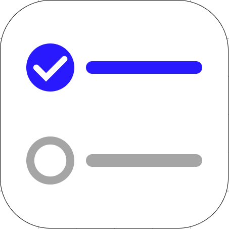

<div align="center">

<h1>Todo App</h1>
</div>

A simple todo app built with [Expo](https://expo.dev/)

## Features

- Add, edit, and delete tasks
- Mark tasks as completed
- Make tasks high priority
- Serch tasks
- Persistent storage with SQLite

## Getting Started

1. Clone the repository

```
git clone https://github.com/Zigl3ur/expo-todo-app.git
cd expo-todo-app
```

2. Install dependencies

```bash
npm install
```

3. Run the app

```bash
npx expo start
```

4. Open the app

- With Expo Go app on your mobile device

- Or use an Android emulator or iOS simulator

```bash
npm run android
npm run ios
```
